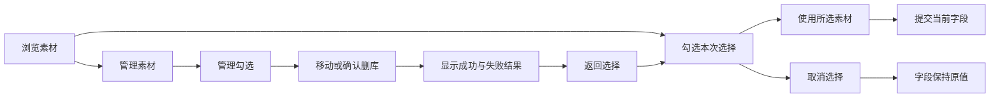

# 组件文案、交互与产品体验优化方案

日期：2026-10-07。范围：当前 `@admin9-labs/admin9-ui` 的 11 个公开组件及内部共享控件。

本方案以产品经理、UI、UX、工程与接入方的不同立场交叉质疑同一方案，再给出推荐决定。依据是本轮重新采集并查看的 9 张截图、浏览器 DOM、当前组件源码和语言包；不把先前审查中的“已修复”或“已通过”当作本轮证据。本文件保留优化前的方案与证据；第一、第二批的实施与最终验收另见 [组件体验实施复审](./component-experience-implementation.md)。

## 结论与目标

最应先解决的是操作对象和完成状态的理解：用户要能分清“从当前字段移除”和“从素材库删除”，“本次选择”和“管理素材”，“上传完成”和“已用于当前字段”。第二批再改善失败恢复、搜索表达、提示一致性与工具栏阅读负担。

P1 表示建议优先安排的核心理解／误操作问题；P2 表示效率和一致性改善；P3 表示需要补充用户或接入方证据的能力调整。这是产品排期优先级，不是已证明的安全漏洞或实际事故等级。

用户后续明确要求保留紧凑图片网格：隐藏可见复选框与文件名，只保留缩略图、选中状态和预览。因此 UX-07 中恢复常显勾选及双行名称的建议已撤回；实际实施与几何验收按这个最新约束执行。

目标用户假设：使用中后台完成素材选择、编辑、筛选、坐标选择和聊天任务的普通业务人员，不要求掌握组件 API、文件状态码或英文图标标识。开发配置、应用保存、服务权限与删除策略仍由消费应用负责。

## 本轮观察路径与证据

截图中的组件名、测试开关、英文表单字段和模拟文件名属于验收宿主；不把它们直接当作组件产品文案缺陷。截图使用桌面弹层和一个窄幅宿主片段，没有完成全部断点的响应式验收。

| 步骤 | 操作与观察 | 健康程度 | 证据 | 对应建议 |
| --- | --- | --- | --- | --- |
| 1 | AImagePicker 开启多选，打开选择图片弹层 | 基本可用；下一步可理解，但素材选择与管理混在同一入口 | 图 01 | UX-01、02、07 |
| 2 | 进入批量操作，选中一张图片 | 受影响；标题仍为“选择图片”，管理区已选 1 项，底部“确认选择”禁用 | 图 02 | UX-02、03 |
| 3 | 点击删除，观察确认弹层，然后取消 | 受影响；有风险提示和危险按钮，但标题与按钮只有“删除”，正文使用“文件” | 图 03 | UX-01、03 |
| 4 | 打开新增分组弹层，然后取消 | 基本可用；字段、上级关系和主次按钮清晰 | 图 04 | UX-08 |
| 5 | 上传一张 SVG 到本地模拟素材服务 | 受影响；成功消息出现，但已选仍是 0；后续说明只保留 5 秒 | 图 05 | UX-04 |
| 6 | AIconPicker 输入中文关键词“搜索” | 受影响；返回 0 个结果和“无匹配图标”，没有说明英文名称搜索方式 | 图 06 | UX-09 |
| 7 | 打开坐标选择，地图成功显示 | 基本可用；有地图与手动输入两条路径，但初始结果区大块留白 | 图 07 | UX-10 |
| 8 | 搜索“中关村”，该环境中搜索失败 | 受影响；关键词与地图保留，提示仅“地点搜索失败” | 图 08 | UX-05、10 |
| 9 | 查看 CoverPicker 与编辑器在窄幅宿主中的默认内容 | 基本可用；封面模式明确，编辑器图标工具栏换行，需要审视信息密度 | 图 09 | UX-11、12 |

### 图 01：选择图片

保留点：分组、结果、数量上限和确认区分区清晰。需要改进的是对象用词和管理入口的表达；文件名在卡片上大量截断，判断相似素材依赖预览或鼠标 title。

### 图 02：管理模式

管理模式实际上使用独立的管理选择集，但没有明确模式标题。“已选 1 项”与底部禁用的“确认选择”容易被理解成选择失效。当前源码确实在管理模式禁止选择确认，见 [确认条件](/Users/fengqiyue/web/admin9-labs/admin9-ui/src/components/file-picker/index.vue:305)。这属于表达与状态展示问题，不建议直接解除禁用。

### 图 03：删除确认

已经有“会删除素材库原文件”的说明和危险按钮，应保留。缺口是操作前后的名称没有明确对象，且弹层没有显示目标缩略图／名称。真实删除由接入服务执行，不能自行增加“永久删除”“无法恢复”“不会影响已使用内容”等未经契约确认的承诺。见 [删除弹层](/Users/fengqiyue/web/admin9-labs/admin9-ui/src/components/file-picker/index.vue:1750)。

### 图 04：新增分组

这个流程没有必要重做。保留“分组名称／上级分组／创建”；把“无（一级分组）”调整为“不设上级（一级分组）”，让“无”的含义更明确。重复名称等具体失败原因是否能展示，要看服务是否提供稳定、可映射的原因。

### 图 05：上传成功但未选择

消息为“当前队列：已上传 1 个文件；请勾选后确认”，下方仍为“已选 0 / 2 项”。现有消息持续 5 秒，并不会自动改变选择，见 [上传完成处理](/Users/fengqiyue/web/admin9-labs/admin9-ui/src/components/file-picker/index.vue:1094)。不应只把消息改成“上传成功”而省略下一步。

### 图 06：图标搜索

当前匹配对象是英文 kebab 名称，见 [图标过滤](/Users/fengqiyue/web/admin9-labs/admin9-ui/src/components/icon-picker/index.vue:61)。截图能证明该关键词没有结果，不能据此断言所有中文关键词或所有用户都会失败。短期说明搜索范围，后续再评估中文别名能力。

### 图 07：坐标选择

地图、搜索、纬度和经度都有位置。建议在尚未搜索的结果区域显示轻量说明“搜索地点，或在地图上选择位置”，明确空白不是加载异常。坐标范围提示属于辅助信息，不需要把全部技术规则常驻成大段正文。

### 图 08：地点搜索失败

关键词和地图保留是良好的恢复基础。建议提示改为“地点搜索失败。请重试，或在地图上选择位置。”并提供“重新搜索”动作。失败原因在本轮没有定位，不归因为网络、Key、权限或 SDK 缺陷。

### 图 09：封面和编辑器

封面模式的“单图／三图／无封面”已经简洁，不建议为了统一词长再改成另一套术语。编辑器存在多组图标及换行；这是密度改善机会，不足以单凭截图证明所有断点都不可用。该截图是浏览器原生采集的窄幅文档片段，非设计稿。

## 角色对抗与推荐决定

| 争议 | 产品经理的主张 | UI／UX 的反对或补充 | 工程／接入方的反对 | 推荐决定 |
| --- | --- | --- | --- | --- |
| 所有删除都弹确认 | 防止误操作，统一流程 | 对字段移除反复确认会拖慢编辑；真正危险的是删库 | 没有通用恢复 API，不能统一“撤销” | 字段用“移除”，正文用“删除内容”，素材库用“从素材库删除”；仅删库保留确认，确认展示对象与范围 |
| 上传后自动选择 | 减少一次操作，符合“上传来使用”的意图 | 已有选择、上限已满、替换场景可能造成意外 | 自动写父模型会破坏草稿／确认契约 | 默认保留原选择；持续反馈“已上传到素材库”，提供“选中本次上传”动作，只更新弹层草稿；超上限明确提示 |
| 选择与管理完全拆成两个产品 | 两个任务分别优化，更清楚 | 会引入更多跳转和重复布局 | 组件库没有业务路由、权限系统的职责 | 复用现有弹层，显式切换模式标题、统计和操作区；选择草稿与管理选择集保持独立 |
| 把所有提示改得更短 | 视觉轻量，便于快速扫描 | 删除后果、下一步和失败恢复不能被删掉 | 文案不能承诺未知的后端行为 | 常用动作短；危险动作写明对象；失败写“结果＋下一步”；复杂键盘说明逐级展示 |
| 空状态都加“立即上传” | 给下一步，提高任务完成率 | 只读或无权限用户会被误导 | 没有对应 service 能力时动作不能成立 | 仅 canUpload 且可编辑时提供上传；有筛选先提供“清除筛选”；只读保留事实说明 |
| 图标搜索直接支持全量中文 | 普通用户无需了解英文 | 搜索语义会更自然 | 287 个中文名／别名有维护成本，不能机器拼接后算完成 | 第一批解释英文名称搜索；第二批按真实高频关键词补别名，保留现有存储值 |
| 所有失败都显示技术原因 | 减少定位成本 | 普通用户需要恢复动作，配置字样增加困惑 | 服务原因不一定适合或允许直出 | 用户区显示可执行提示；诊断对象、事件和开发文档保留技术原因；业务原因由接入方映射 |
| 编辑器默认收起大部分功能 | 工具栏更简单 | 隐藏常用功能会降低效率和键盘可发现性 | 改默认会影响已有消费应用 | 先优化分组、提示和窄幅换行；有使用数据后再决定收纳哪些低频工具，不先新增复杂工具栏配置系统 |

## 优化项与验收标准

| ID／优先级 | 所属组件、位置 | 当前问题／证据 | 推荐调整 | 完成标准 | 责任范围 |
| --- | --- | --- | --- | --- | --- |
| UX-01／P1 | ImagePicker、CoverPicker、FilePicker、编辑器的移除／删除入口 | 字段移除、正文删除、素材库删除容易被同一“删除”理解；图 03，相关源码 | 字段统一“移除”；删库按钮和标题写明“素材库”；删除弹层显示缩略图、名称和数量 | 不看帮助即可指出删除对象；点击字段移除不调用 deleteFiles；确认删库才调用服务 | 组件库文案与确认内容；后端提供删除策略 |
| UX-02／P1 | FilePicker 及所有嵌套使用点，批量管理模式 | 管理已选数量与禁用“确认选择”并存；图 02 | 入口“管理素材”；标题“管理图片／管理文件”；统计“待管理 {count} 项”；管理区使用“返回选择”，底部隐藏选择提交动作 | 切换前后模式清楚；管理勾选不污染选择草稿；返回选择恢复原草稿；只读／禁用不能绕过 | 组件库 |
| UX-03／P1 | FilePicker 管理完成后的取消／关闭 | 删除、移动即时执行；“取消”不能撤销已执行的管理操作；源码见下 | 管理模式使用“返回选择／关闭”；选择模式的“取消选择”只表示不提交选择草稿；完成管理时给出已执行结果 | 关闭弹层不被描述为撤销删除；单次确认不重复请求；取消删除不调用服务 | 组件库；回收站／撤销由业务后端另行决定 |
| UX-04／P1 | FilePicker 上传结束反馈 | 上传完成仍需勾选，提示只显示 5 秒；图 05 | 弹层内保留本批结果条，“已上传到素材库，尚未选用”；添加“选中本次上传”；有剩余上限时添加到草稿，超额说明未选数量 | 消息消失后仍知道下一步；已有选择保持；超过上限不静默替换；必须确认才提交父模型；部分失败可逐项恢复 | 组件库；保存归消费应用 |
| UX-05／P1 | CoordinatePicker 搜索／地图错误区；通用失败提示 | 地点搜索只报告失败；图 08。文件上传虽有重试，但不同原因仍需明确对应动作 | 可恢复错误保留输入并给重试；地图可用时提示地图选点；地图不可用时提示手动经纬度；类型／大小失败提示换文件或压缩 | 按钮和下一步与实际能力匹配；重试不会清空草稿；明确不支持重试的失败不显示无效重试 | 组件库；业务服务原因映射由接入方 |
| UX-06／P2 | FilePicker／ImagePicker 纯图片选择模式 | “选择图片”中仍有“搜索文件”“全部文件”“{count} 个文件”等通用用词；图 01、03、05 | 根据允许类型切换“图片／文件”与“张／个”；混合类型保留“文件／项”；管理统计与选择统计分开 | 纯图片、混合文件、单选、多选的标题／搜索／统计／确认文案一致；所有参数与英文键同步 | 组件库语言包及上下文选择 |
| UX-07／P2 | 文件卡片、选择上限、预览动作 | 相似素材名大量截断，卡片动作依赖悬停；图 01、02 | 保留缩略图优先；必要时两行显示文件名并保留扩展名；保留现有 title，同时为触摸提供可读名称；选中状态增加明确勾选标记 | 鼠标、键盘、触摸均能判断当前选择；达到上限时提示“已选满，可先取消一项”；预览不会意外选择 | 组件库；不扩大为业务详情页 |
| UX-08／P2 | 新增分组弹层 | “无（一级分组）”的对象省略；失败原因只有通用文案；图 04 | 使用“不设上级（一级分组）”；保留当前字段结构；能够识别重复名称时映射成字段提示，否则通用重试提示 | 空名称提示落在字段；服务失败保留名称和父级；成功后能看见新分组；不把任意 exception.message 直出 | 组件库；结构化重复原因由 service 提供 |
| UX-09／P2，别名能力 P3 | IconPicker 搜索及 tooltip | 中文关键词无结果，提示未说明按英文名检索；图 06 | 短期“按英文名称搜索，如 search”；无结果提示换英文关键词或切换分类；后续增加高频中文名称／别名，展示友好名＋标识 | 英文、IconSearch、icon-search 既有查询形式回归；新中文别名有真实映射；modelValue 不变；不生成未知图标 | 组件库；中文别名范围需使用证据 |
| UX-10／P2 | CoordinatePicker 初始、手动输入及确认 | 初始搜索结果区留白，确认按钮“确定”未说明确认对象；图 07 | 初始说明“搜索地点，或在地图上选择位置”；按钮“使用此坐标”；辅助说明纬度／经度范围；选择后明确展示两种坐标值及选中状态 | 地图选点、搜索、手动输入均能完成；只输入一项时知道为何不能确认；失败替代路径可用；不推断逆地理地址 | 组件库；地点业务含义归应用 |
| UX-11／P2 | CoverPicker 封面位置与空槽 | 模式本身清晰，但空槽只有加号，可见位置提示不足；图 09 | 保留“单图／三图／无封面”；空槽显示“添加封面”或“封面 1／2／3”；有图仍提供更换、移除的清楚提示 | 模式切换保留当前已有语义；三图不会暗示已满足业务必填规则；不把全部空槽重新排序 | 组件库；数量必填规则归宿主表单 |
| UX-12／P2 | 编辑器工具栏、格式刷状态条、表格粘贴 | 窄幅工具栏换行；格式刷提示同时解释鼠标、键盘和触摸；图 09＋语言包 | 常用工具保持可见；分组和换行保持完整；格式刷主提示精简，保留“应用格式”“取消格式刷”；复杂说明放入可展开帮助；粘贴表格保持格式示例 | 窄幅状态无不可达按钮；键盘、触摸不因删文案丢失操作指引；Esc、Enter、鼠标选择实际行为匹配 | 组件库；不先更改默认工具集 |
| UX-13／P1 接入契约 | 编辑器图片上传与应用保存 | 上传状态由组件提供，保存由应用负责；源码，未验收真实业务保存 | 接入说明必须用 canSave 控制保存；上传中与失败区分提示，保留正文；失败图片可重试或移除 | 存在 pending／failed 图片时应用不会误报告保存完成；失败恢复后正文保留；组件不自行调用业务保存 API | 消费应用＋组件使用文档；组件维持现有状态 API |
| UX-14／P2 | ChatComposer 占位提示、发送禁用状态 | 快捷键放在长 placeholder；submitDisabled 原因组件未知；DOM／源码 | 占位“输入消息…”；键盘提示独立显示并关联输入框；输入无障碍名称用“消息内容”；附加上传等禁用原因由宿主插槽提示 | 输入后仍能找到发送方法；IME 确认不会误发；Enter／Shift+Enter 不改；宿主原因提示与实际阻塞状态一致 | 组件库通用提示；禁用原因归消费应用 |
| UX-15／P2 | ChatMessageList 状态与错误后恢复 | “生成失败／已停止”描述状态，重试行为由应用负责；DOM／源码 | 统一“等待回复／正在回复／回复失败／已停止回复”；保留已生成内容；宿主在 actions 插槽提供重新生成等真实操作 | 不因文案改变丢失部分回复；流式正文不逐字 live 播报；重试指向失败消息，且不与正在生成冲突 | 组件库状态文案；请求与重试归消费应用 |
| UX-16／P2 | FilterForm 折叠与重置 | 默认“展开／收起”未说明对象；隐藏字段是否有值由宿主决定；DOM／源码 | 改“更多筛选／收起筛选”；宿主在表单附近显示已生效条件摘要；保留“查询／重置” | 收起后用户能知道仍有条件生效；重置按已定义初始值处理，不承诺一定清空；隐藏字段不被静默忽略 | 组件库通用按钮；摘要和业务条件归宿主 |
| UX-17／P1 接入契约，文案 P2 | ProTable 搜索、刷新、失败后的数据状态 | 默认“搜索”不说明字段；请求 error 交给消费方，可能仍显示旧数据；DOM／源码 | 宿主通过已有工具栏／表格前插槽说明搜索范围和失败；失败时标明“刷新失败，当前显示上次结果”并提供重试；默认通用搜索不猜测业务字段 | 刷新失败不被误认为数据已更新；正在刷新期间防止重复操作；关键字段搜索提示由应用配置，不写死在库 | 消费应用为主；组件文档给出接入范例 |
| UX-18／P2 | 共享预览、Arco 控件、全部组件中英文与无障碍说明 | 本库“适应屏幕／原始大小”与 Arco tooltip“全屏／原始尺寸”不同；源码已确认 | 为同一控件统一 tooltip 与 aria-label；当前 fullScreen 缩放按铺满方向计算，建议命名“铺满预览区 / Fill preview”；宿主同步 Arco locale 与 vue-i18n locale；单独核对 Arco 固定 Close 名称 | 同一动作看见的提示与朗读名称一致；中文／英文不混用；不可仅批量替换本库字符串后声称第三方也完成 | 组件库包装层＋宿主语言配置；第三方限制单列 |

预览动作的当前实现见 [Arco fullScreen 缩放计算](/Users/fengqiyue/web/admin9-labs/admin9-ui/node_modules/@arco-design/web-vue/es/image/preview.vue_vue_type_script_lang.js:259)：使用宽高比中的较大值，不是浏览器原生全屏 API；“适应屏幕”通常暗示整图可见，因此不建议继续沿用这个名称。本轮未在不同宽高比图片上逐一点击验证裁切。

UX-03 的即时管理行为见 [服务调用及列表更新](/Users/fengqiyue/web/admin9-labs/admin9-ui/src/components/file-picker/index.vue:746)。UX-13 的上传状态与错误映射见 [编辑器上传集成](/Users/fengqiyue/web/admin9-labs/admin9-ui/src/components/tiptap-editor/index.vue:340)。UX-14 的禁用与 IME 守卫见 [发送条件与键盘处理](/Users/fengqiyue/web/admin9-labs/admin9-ui/src/components/chat-composer/index.vue:43)。UX-15 已有“只播报状态、不逐字播报正文”的设计见 [消息状态播报](/Users/fengqiyue/web/admin9-labs/admin9-ui/src/components/chat-message-list/index.vue:99)。UX-17 的错误传播见 [数据请求](/Users/fengqiyue/web/admin9-labs/admin9-ui/src/components/pro-table/index.vue:227)。

## 建议文案表：现状 → 调整

以下是待实施的建议，不是已经替换的清单。新增文案需形成独立语言键；不借用语义不同的旧键。带类型、数量的文字按上下文选择，不做字符串尾部拼接。英文功能语义与中文一致，不强求字面逐词翻译。

| 使用位置／语言键 | 当前中文 | 建议中文 | 建议英文 | 使用边界 |
| --- | --- | --- | --- | --- |
| imagePicker.remove | 移除图片 | 移除图片 | Remove image | 保持；只移除当前字段选择 |
| filePicker.batch | 批量操作 | 管理素材 | Manage assets | 进入管理模式 |
| 管理弹层标题，新增键 | 与选择模式相同 | 管理图片／管理文件 | Manage images / Manage files | 仅管理模式 |
| 管理模式计数，新增键 | 已选 {count} 项 | 待管理 {count} 项 | {count} items selected for management | 与选择计数区分 |
| filePicker.exitBatch | 退出 | 返回选择 | Back to selection | 返回原选择草稿 |
| 素材库删除入口，建议独立键 | 删除 | 从素材库删除 | Delete from library | 不同时用作正文删除或字段移除 |
| 素材库删除标题，建议独立键 | 删除 | 从素材库删除图片？／从素材库删除文件？ | Delete images from the library? / Delete files from the library? | 明确对象与范围 |
| filePicker.deleteConfirm 的图片分支 | 确定删除选中的 {count} 个文件？此操作会删除素材库原文件。 | 将从素材库删除选中的 {count} 张图片。请核对后确认。 | This will delete {count} selected images from the library. Check the selection before confirming. | 不承诺永久性、可恢复性或其他页面影响 |
| filePicker.deleteConfirm 的混合类型分支 | 同上 | 将从素材库删除选中的 {count} 个文件。请核对后确认。 | This will delete {count} selected files from the library. Check the selection before confirming. | 配合目标名称／缩略图 |
| 删除确认主按钮，新增键 | 删除 | 确认删除 | Confirm deletion | 危险样式；标题已经说明素材库 |
| 选择模式取消按钮，建议独立键 | 取消 | 取消选择 | Cancel selection | 只取消未提交选择；已执行管理不回滚 |
| filePicker.confirm，图片分支 | 确认选择 | 使用所选图片 | Use selected images | 有图片选择时；清空场景需单独文案 |
| filePicker.confirm，文件分支 | 确认选择 | 使用所选文件 | Use selected files | 附件及混合文件 |
| 明确空选择提交，新增键 | 确认选择 | 清空当前选择 | Clear current selection | 原来已有值、本次确认空选择；保留清空提示 |
| filePicker.confirmEmpty | 确认后将清空已选文件 | 确认后将移除当前字段的已选文件，素材库文件会保留。 | Confirming removes the selected files from this field. The library files are kept. | 仅当前字段清空；编辑器替换场景按实际行为处理 |
| filePicker.searchPlaceholder，图片分支 | 搜索文件 | 搜索图片名称 | Search image names | 当前 adapter 确认按名称搜索；其他服务范围由接入方说明 |
| filePicker.groupAll，图片分支 | 全部文件 | 全部图片 | All images | 仅允许图片时 |
| 已选数量，图片分支 | 已选 {count} / {limit} 项 | 已选 {count}/{limit} 张 | {count}/{limit} images selected | 固定计数单位，不混同管理项数 |
| 上传结果持续说明，新增键 | 当前队列：已上传 {count} 个文件；请勾选后确认 | 已上传 {count} 个文件到素材库，尚未选用。 | {count} files uploaded to the library. They have not been selected. | 文案按本批是否有未选上传项变化 |
| 上传结果动作，新增键 | 无 | 选中本次上传 | Select uploaded files | 仅选择可用的新上传项，服从上限 |
| filePicker.fileActions.deleteSuccess | 已删除 {count} 个文件 | 已从素材库删除 {count} 个文件 | Deleted {count} files from the library | 仅服务确认成功的数量 |
| filePicker.fileActions.deletePartial | 已删除 {count} 个文件，{failed} 个删除失败 | 已删除 {count} 个文件，{failed} 个未删除。可重试未删除的文件。 | Deleted {count} files. {failed} were not deleted. Retry the remaining files. | 若提供重试入口；否则保留事实统计、不承诺按钮 |
| filePicker.fileActions.movePartial | 已移动 {count} 个文件，{failed} 个移动失败 | 已移动 {count} 个文件，{failed} 个未移动 | Moved {count} files. {failed} were not moved. | 保留成功与失败选择状态 |
| filePicker.rootGroup | 无（一级分组） | 不设上级（一级分组） | No parent (top-level group) | 不改变分组数据结构 |
| iconPicker.searchPlaceholder | 搜索图标 | 按英文名称搜索，如 search | Search by name, e.g. search | 中文别名支持前的过渡方案；上线别名后重新调整 |
| iconPicker.empty | 无匹配图标 | 未找到匹配图标，请换个英文关键词或切换分类 | No matching icons. Try another keyword or category. | 不假装支持中文语义搜索 |
| coordinatePicker.confirm | 确定 | 使用此坐标 | Use these coordinates | 已形成有效坐标时 |
| coordinatePicker.searchFailed，地图可用分支 | 地点搜索失败 | 地点搜索失败。请重试，或在地图上选择位置。 | Place search failed. Retry or choose a location on the map. | 地图确实可用 |
| coordinatePicker.searchFailed，地图不可用分支 | 地点搜索失败 | 地点搜索暂不可用，可手动输入经纬度。 | Place search is unavailable. Enter the latitude and longitude manually. | 手动输入仍可用 |
| coordinatePicker.missingApiKey | 请配置腾讯地图 API Key | 地图暂不可用，可手动输入经纬度。 | The map is unavailable. Enter the latitude and longitude manually. | 技术配置要求保留在开发文档／诊断层 |
| 空搜索结果区说明，新增键 | 空白 | 搜索地点，或在地图上选择位置 | Search for a place or choose a location on the map | 尚未搜索时，不能和“未找到结果”共用 |
| tiptapEditor.painterHint | 包含鼠标、键盘、触摸全部操作说明的一段长文 | 已复制格式。选择目标文字后应用。 | Format copied. Select the text to apply it to. | 配合“应用格式”按钮与可展开操作帮助；保留 Esc／Enter 指引 |
| tiptapEditor.painterCancel | 取消 | 取消格式刷 | Cancel format painter | 明确取消对象 |
| tiptapEditor.pasteTablePlaceholder | 粘贴以制表符分列、换行分行的表格数据 | 粘贴从 Excel 等表格中复制的内容。每行是一行数据，制表符用于分列。 | Paste cells copied from a spreadsheet. New lines create rows; tabs separate columns. | 不声称支持上传 Excel 文件或任意 HTML 表格格式 |
| chatComposer.placeholder | 输入消息，Enter 发送，Shift+Enter 换行 | 输入消息… | Type a message… | 快捷键迁移到持续可见的独立说明后再修改 |
| 聊天输入框无障碍名称，新增键 | 复用长 placeholder | 消息内容 | Message | textareaAttrs 自定义 aria-label 仍优先 |
| 聊天快捷键说明，新增键 | 放在 placeholder | Enter 发送，Shift+Enter 换行 | Enter to send; Shift+Enter for a new line | 桌面键盘路径；触摸入口保持明显 |
| chatMessageList.status.streaming | 正在生成 | 正在回复 | Responding | 助手回复状态 |
| chatMessageList.status.error | 生成失败 | 回复失败 | Reply failed | 重试操作由消费应用提供 |
| chatMessageList.status.stopped | 已停止 | 已停止回复 | Reply stopped | 部分正文保留，不暗示已清空 |
| filterForm.expand | 展开 | 更多筛选 | More filters | 显示其他筛选字段 |
| filterForm.collapse | 收起 | 收起筛选 | Fewer filters | 隐藏额外字段，不撤销其条件 |
| 文件／图片无匹配结果 | 未找到匹配的文件／图片 | 保持事实说明，旁边提供清除筛选 | No matching files / images；Clear filters | 不把无结果错误地描述为服务失败 |
| 预览 fullScreen | aria-label“适应屏幕”，tooltip“全屏” | 铺满预览区 | Fill preview | 当前版本使用较大的宽高缩放比，属于铺满方向；通过局部包装统一提示，不全局修改宿主 Arco 文案；上线前实测宽图与高图 |

## 推荐交互规则

### 选择与管理

选择模式只修改临时选择，点击“使用所选图片／文件”才向父模型提交。取消只丢弃这份草稿。已有选择上限、只读、禁用和清空规范模型的行为保持。

管理模式标题明确“管理图片／文件”，使用另一套勾选统计。移动和删除是对素材服务的操作：移动显示结果，删除先确认对象。完成后返回选择模式；不把“取消选择”描述成撤销已执行管理。

### 上传与确认

上传完成是素材服务操作完成，不代表字段已经使用该素材，也不代表整个业务表单已保存。结果条应靠近上传／选择区域，保留成功、失败和未选用的信息。点击“选中本次上传”只修改选择草稿，不能绕过上限、状态检查或既有选择；按真实成功 ID 去重。

达到上限时，先解释为什么不能继续选择，再提供取消部分选择的路径。上传失败的格式／类型／大小问题应要求换文件或压缩；服务暂时失败才提供重试。取消上传是停止任务，不等于删除已成功上传的素材。

### 错误与状态

同一区域状态按“未操作／加载／空结果／失败／成功但尚需下一步”区别表达。错误提示至少告诉用户哪里失败，以及当前能够执行的下一步；保留已输入内容，重试中不重复提交。

已有部分成功统计、文件类型限制、选择上限、地图手动输入、消息阅读位置和状态播报应保留。不会为了提示统一而让上传失败变成整个表单阻塞，也不会让一个素材失败清空其余成功结果。

## 组件库与消费应用的分工

| 组件库应承担 | 消费应用应承担 | 需要后端／service 契约才可承诺 |
| --- | --- | --- |
| 通用动作命名、模式与计数、选择／上传反馈、默认状态提示、无障碍名称、可执行恢复入口 | 业务字段标签、权限、具体 API、保存动作、聊天请求与重试、表格查询范围、业务错误映射、宿主语言配置 | 永久删除／软删除、回收站／撤销、文件引用影响、分组名称重复原因、权限拒绝原因、上传格式真实验证 |

优先复用现有组件状态和插槽。ProTable 的工具栏／before-table，ChatComposer 的 header／toolbar／action，以及消息列表的 actions／empty 已经是接入方扩展入口。避免把路由、保存 API、业务字段推入组件库，也不增加通用 hook、公共工具函数或无明确需求的配置体系。

## 全组件覆盖与证据强度

| 组件 | 本轮依据 | 推荐方向 | 不应扩大的范围 |
| --- | --- | --- | --- |
| AFilePicker | 图 01–05；源码、语言包 | 选择／管理模式、删库对象、持续上传反馈、图片上下文文案 | 业务权限、回收站与应用路由 |
| AImagePicker | 图 01–03、05；源码 | 字段移除与删库区分，选图入口与反馈 | 删除服务之外的文件引用处理 |
| ACoverPicker | 图 09；源码 | 空槽提示、位置语义、维持模式规则 | 业务封面必填或发布政策 |
| AFileUploader | 图 05 的嵌套成功链路；源码 | 完成与选用区分，失败动作、队列计数口径 | 业务保存与后端内容检测 |
| AIconPicker | 图 06；过滤源码 | 说明检索范围，后续评估中文别名 | 改现有图标存储值 |
| ACoordinatePicker | 图 07–08；源码 | 初始引导、失败替代路径、确认对象 | 地址解析与业务地点校验 |
| ATiptapEditor | 图 09、浏览器 DOM；源码 | 工具栏密度、复杂提示分层、上传状态与保存接入 | 业务自动保存、工作流 |
| AChatComposer | 浏览器 DOM、源码；无可接受截图 | 持续键盘说明，宿主解释发送禁用原因 | 聊天请求与附件上传管理 |
| AChatMessageList | 浏览器 DOM、源码；无可接受截图 | 回复状态术语，宿主提供恢复动作 | 会话／请求管理 |
| AFilterForm | 浏览器 DOM、源码；无可接受截图 | 更多筛选与已生效条件解释 | 自动推断业务条件、存储查询 |
| AProTable | 浏览器 DOM、源码；无可接受截图 | 宿主显示搜索范围、刷新失败与旧数据状态 | 业务查询字段、权限和 API |

## 实施顺序与验证

| 批次 | 内容 | 最小充分验证 |
| --- | --- | --- |
| 1：动作含义与结果 | UX-01、02、03、04；先定统一术语和状态图，再调整选择／管理标题、删除对象展示与上传结果条 | 单选／多选、图片／混合文件、空选择、返回选择、取消删库、部分成功、上限已满、禁用／只读、嵌套编辑器；中文和英文浏览器流程各一遍，相关选择与操作测试 |
| 2：恢复与一致性 | UX-05–12、18；错误下一步、纯图片上下文、搜索说明、分组和工具栏提示 | 重试保留输入，地图可用与不可用分支，文件错误各原因，图标名称回归，tooltip／aria 名称一致；目标控件 Tab、Enter、Esc 验证及窄幅查看 |
| 3：宿主接入与能力验证 | UX-13–17；保存状态、聊天禁用说明、筛选摘要、表格旧数据提示；中文图标别名是否实施由真实检索需求决定 | 真实消费应用 smoke；编辑器失败图片不能被误报告已保存；发送禁用有真实原因；刷新失败明确仍为旧结果；折叠条件与重置行为一致 |

下一轮建议的用户任务验证：让未看文档的业务用户依次完成“替换字段图片”“删库中的图片”“上传后用于当前字段”“搜索失败后选定位置”。记录是否能准确说出操作对象、是否能找到下一步、是否误认为取消会撤销删除、以及错误恢复是否保留已有输入。当前没有用户样本或完成率数据，因此不虚构改善百分比。

上传数量还有一个应先核对的口径：目前校验按 `internalTasks.indexOf(task)` 与 limit 比较，文案叫“每批”。见 [队列数量校验](/Users/fengqiyue/web/admin9-labs/admin9-ui/src/components/file-uploader/index.vue:217)。失败／取消记录保留后，再添加文件时应复现并确定 limit 是当前队列还是本次新增批次；在行为确定前，不只改成更好听的“每批最多”。这项目前是源码发现的复核点，不计作已浏览器复现的缺陷。

## 保留的边界

本轮没有实际调用生产素材删除，没有接入真实业务保存、聊天或表格 API；上传使用仓库本地验收服务。地图加载成功，地点搜索在本轮环境失败，但原因未诊断。删除确认之后的结果分支依据当前源码，不把未执行的真实删除说成已经通过。

截图工具在聊天、筛选、表格等后续区域多次绘制超时；相关建议依据浏览器 DOM 和源码，未对它们的视觉质量作验收声明。未完成真实触摸设备、所有响应断点、暗色／英文全路径、屏幕阅读器、对比度或完整键盘流测试，不能声称完整无障碍合规。

素材是否可恢复及是否影响其他内容，必须由接入方确定后才能写入确认文案。文案清单仍见 [组件运行时文案清单](/Users/fengqiyue/web/admin9-labs/admin9-ui/docs/reviews/component-copy-inventory.md)，本方案不替代它，也没有把建议字符串当作当前已经存在的值。
