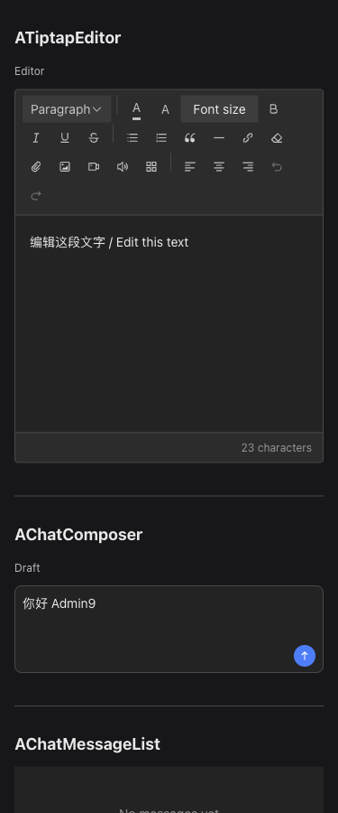
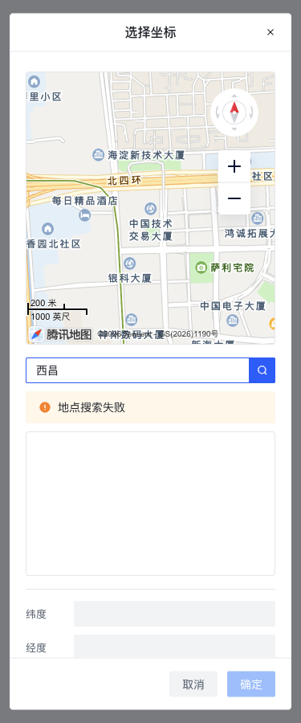

# 全组件成熟度与 Arco 一致性审查

本文保留首轮实施的审查与验证记录；当前提交前的独立复核及后续修复见 [独立 diff 复核记录](./independent-diff-review.md)。首轮通过的测试不代表后续复核没有发现遗漏。

审查基线：`0a7b9ee251bcc3a268a4b2a15d72414ad87a99cf`，包版本 0.20.0，起始工作区干净。官方参照为实际安装的 Arco Design Vue 2.57.0；不升级依赖、不保留历史 API 兼容、不修改业务应用。

## 证据与判断规则

官方证据取自 `node_modules/@arco-design/web-vue/es/`：`_hooks/use-form-item.js`（表单禁用、尺寸、校验）、`input/input.js` 和 `select/select.js`（用户 change 与模型回显）、`textarea/textarea.js`（输入事件）、`table/table.js` 与 `table/hooks/use-row-selection.js`（selectedKeys、selectionChange、select、sorterChange、filterChange）、`form/form.js`（submit、resetFields、公开方法）、`config-provider/config-provider.js`（全局配置）。以上是版本固定的发行源码，不以最新版网站或 React 版本猜测契约。

相同概念沿用官方语义；不同职责保留有依据的差异。受控输入更新仅回显，不自动纠正父模型或冒充用户 change。用户提交先 update:modelValue，再 change；内部草稿操作不触发外层字段校验。默认状态和空值按组件职责确定。没有确认缺陷的实现保持。

## 首轮覆盖与目标决定

| 组件             | 审查范围与发现                                                                                                                                          | 决定                                                                                                                                                           |
| ---------------- | ------------------------------------------------------------------------------------------------------------------------------------------------------- | -------------------------------------------------------------------------------------------------------------------------------------------------------------- |
| IconPicker       | Input/Popover、值/清空、尺寸、分类搜索、方向键、焦点、属性透传；漏 Form 禁用与选择提交校验，size 缺 mini                                                | 接入公开 useFormItem，Size 使用官方类型；相同值选择不重复 change；导出完整类型和 focus/blur                                                                    |
| CoordinatePicker | 模型、草稿、确认取消、地图销毁、搜索竞争、坐标范围、尺寸、键盘、标签；漏表单契约，空搜索可能保留 loading，未监听 SDK 配置变化                           | searchEnabled 改 allowSearch；补 size、表单提交校验、搜索复位、配置变更处理、输入框键盘与焦点返回                                                              |
| FileUploader     | 队列、数量/大小、取消、重试、部分成功、服务切换、卸载、弹层；重试绕过数量/大小限制，命令绕过禁用                                                        | maxFiles 改 limit；重试重新验证，表单禁用生效；accept 保留文件选择提示语义，后端负责真实内容验证                                                               |
| FilePicker       | 单多选、跨页草稿、服务分页、筛选、限制、错误恢复、上传整合；无 disabled/readonly，外部输入触发 change，卸载未失效请求                                   | 增加表单状态与尺寸；change 与模型同形，新增 confirm 数组载荷供媒体插入；defaultView 替代 initialView；回显不写回，上传 success 只转发验证成功                  |
| CoverPicker      | 模式与固定位置、替换清空、预览失败、异步操作代次、模型回显、尺寸；自动纠正模型触发 change，表单 change 漏触发                                           | 保留固定封面布局；移除自动回写，补 readonly、表单校验、mini 与表单尺寸；依赖 FilePicker confirm                                                                |
| FilterForm       | 布局、隐藏字段、验证、重置、动态字段、透传；覆盖官方 submitSuccess/submitFailed 监听，reset 不重置值，无 Form 方法                                      | 保留 search 作为筛选业务语义事件，同时完整转发官方提交事件；reset 使用 Form resetFields；公开 Form 方法；操作按钮跟随 size/disabled                            |
| ProTable         | fetcher、分页、选择、透传、列与插槽、刷新、失败、并发；rowSelection.onChange 非官方接口，selectedRowKeys/select 语义不符，卸载回写，pageSize 更新不生效 | 使用 selectedKeys/selectionChange 官方接口；保留 select 原始事件透传；删除 boolean refresh 重载和 action 兼容插槽；明确排序筛选通过官方事件和 fetcher 闭包接入 |
| TiptapEditor     | HTML/JSON、外部回显、字数、选区、撤销、表格、媒体、粘贴、URL、安全 schema、资源释放；未接入 Form，setEditable 默认产生 update                           | 接入 Form disabled/error/校验，setEditable 不 emitUpdate；公开 exposed 类型；保留高度参数，不增加无明确定义的整体 size                                         |
| ChatComposer     | 受控输入、发送停止、IME、字数、自适应、插槽、焦点；Form 禁用仅影响内部 textarea，发送操作仍可触发；属性落在外壳                                         | 用 Form 状态守卫整个操作；补 readonly、textareaAttrs、input/change/focus/blur 与 blur 方法；尺寸使用官方 Size，布局默认仍为 large                              |
| ChatMessageList  | 渲染安全、消息状态、插槽、锚点保持、历史前插、流式更新、隐藏恢复、资源释放、SSR                                                                         | 保持已有实现，复验浏览器阅读位置、长文本和多实例；不增加 size 或会话/请求管理                                                                                  |

## 发现清单

| ID  | 级别/分类 | 场景、影响与整改验收                                                                                                                    | 状态   |
| --- | --------- | --------------------------------------------------------------------------------------------------------------------------------------- | ------ |
| A01 | P1 缺陷   | ProTable 真实 Arco 行选择无模型通知；改为官方 selectedKeys/update 事件，增加真实 Arco 行勾选测试，不能继续依赖错误测试桩                | 已修复 |
| A02 | P1 缺陷   | 选择器、编辑器和聊天发送在 Form disabled 下仍可改变值/发起操作；公开 useFormItem 统一守卫，验证动态禁用和局部 false 不绕过 Form         | 已修复 |
| A03 | P2 缺陷   | 自定义选择提交不触发字段 change 校验；提交后触发 Form handlers，弹窗内搜索/草稿控件用 no-style FormItem 隔离校验                        | 已修复 |
| A04 | P2 一致性 | FilePicker/CoverPicker 外部回显反向写值并 change，导致加载时验证或循环；仅归一化展示，测试外部更新不 emit                               | 已修复 |
| A05 | P2 缺陷   | 上传大小/数量拒绝后 retry 可直接上传；复用限制验证并处理禁用，测试限制失败重试不请求                                                    | 已修复 |
| A06 | P2 缺陷   | 表格和文件请求卸载后仍更新/emit；卸载使代次失效，请求隔离回归与卸载失效源码复核                                                         | 已修复 |
| A07 | P2 缺陷   | 地图搜索中清空关键词不复位 loading；SDK 参数变化未重建，补状态复位回归与配置监听源码复核                                                | 已修复 |
| A08 | P2 缺陷   | FilterForm 覆盖官方 submit 回调且 reset 不恢复初值；转发提交事件、恢复默认值和方法，验证隐藏字段与回调次数                              | 已修复 |
| A09 | P2 一致性 | FilePicker change 与 modelValue 不同形、上传未验证 response 被称为 success；change 同形，confirm 返回文件数组，success 只转发有效结果   | 已修复 |
| A10 | P2 一致性 | 公开 Action/Slot 太宽泛、Admin9UIOptions 兼容别名、refresh boolean/action 插槽双入口；明确组件类型名称，删除旧入口，类型和 tarball 验证 | 已修复 |
| A11 | P2 缺陷   | Tiptap 禁用切换调用 setEditable 触发伪 change；禁用仅改变可编辑性并同步 ARIA，测试不回写                                                | 已修复 |
| A12 | P2 缺陷   | ProTable pageSize prop 更新未触发请求；分页参数变化重置页码并只发一次请求                                                               | 已修复 |
| A13 | P2 一致性 | ChatComposer textarea 原生属性/事件被外壳截留；提供 textareaAttrs、转发输入事件和 blur，测试标签与 IME                                  | 已修复 |

## 合理差异与可选增强

- FilePicker 返回 FileItem，CoordinatePicker 返回坐标对象，CoverPicker 返回封面模式结构；不改成普通 Select 的标量。FilePicker 的 confirm 表示显式确认，即使同值仍触发；change 只在值变化时触发。
- accept 是原生文件对话框提示，不作为安全承诺；真实 MIME、文件内容和权限仍属应用后端。上传器保留部分成功和独立任务错误，不强套官方 Upload 的 fileList。
- ChatMessageList 不增加 size；Tiptap 使用 minHeight/maxHeight 和内部工具栏密度。CoverPicker 与 Composer 的尺寸描述组合布局；Arco 子控件遵循官方尺寸，未配置时使用其全局继承。
- ProTable 继续拥有数据、loading 和页码；服务端排序/筛选通过透传的 sorterChange/filterChange 更新调用方闭包并 refresh，不新增第二套 query 状态或本地假排序。已有官方本地排序行为保留并说明它只作用于已加载行。
- 弹层 visible/v-model 控制、聊天会话/请求、附件队列、编辑器协同、地图坐标系转换和新增管理页面均不自动扩展。已有 open/close 方法满足现有核心场景。
- 不新增主题系统、通用公共 hooks、缓存/虚拟化层或工具链升级。

## 补充发现

- A14 / P1 / 内容安全：FileItem.url 直接进入下载链接，缩略图也未限定协议。新增私有 URL 校验供 FilePicker、Uploader、CoverPicker 和 FileItemView 共用，拒绝 javascript/data 等协议；安全媒体内容规则仍由编辑器 schema 单独维护。验证：恶意 adapter 返回结果被拒绝，正常相对文件预览与上传保持可用。
- A15 / P2 / 搜索功能：Arco InputSearch 的 search 只由搜索按钮产生，Enter 是独立 pressEnter 事件。三个搜索入口补显式 Enter 处理，测试真实 InputSearch 空搜索和迟到响应。
- A16 / P2 / 确认幂等：独立 confirm 事件引入后，已关闭弹层的旧按钮仍可触发重复插入；提交必须要求当前 visible，保留真实编辑器重复点击回归测试。

- A17 / P2 / 布局：真实 FormItem 中 Composer 宽仅 180px、Editor 宽约 895px，而可用宽 1068px；补根节点 width:100% 和 border-box，使输入区域填满字段，按钮型选择/上传仍保持内容宽度。
- A18 / P2 / 原生属性：Arco Textarea 不把 readonly 根属性转给 textarea；通过 textareaAttrs 设置原生 readonly，并守卫 updateValue，新增真实 textarea 回归。

- A19 / P2 / 国际化布局：编辑器字号菜单套用图标按钮 30px 固定宽，英文 Font size 与相邻按钮重叠；为文字菜单使用自适应宽度，与段落菜单一致。

- A20 / P2 / 尺寸与属性：FilterForm 将裸 disabled 留在 attrs，空串未禁用按钮；明确 Boolean/Size props。ProTable 显式 size 只到 Table，搜索和固定 32px 刷新按钮不一致；统一透传 size 并移除固定尺寸。

- A21 / P2 / 官方参数语义：Composer 的 maxLength=0 被提交守卫当作零字上限，但 Arco Textarea 认为无限制；统一为 <=0 不限制，并接受官方 autoSize 的 boolean 形式。

## 验证记录

验证完成日期：2026-09-13。下列结论来自本次工作区和实际浏览器，不代表 GitHub Actions 或生产业务验收。

| 验证层级           | 结果与证据                                                                                                                                                                                                     |
| ------------------ | -------------------------------------------------------------------------------------------------------------------------------------------------------------------------------------------------------------- |
| 全量组件与脚本测试 | Vitest 24 个文件、314 项测试通过，包含 9 项真实 Arco 集成测试；最后的英文标签还原后，ProTable/public-api 的 51 项相关测试再次通过                                                                              |
| 静态与构建         | type:check、acceptance:typecheck、ESLint、Stylelint、changelog:check、acceptance:build 均通过                                                                                                                  |
| 安装包             | 最终真实 tarball 在隔离消费目录安装，公开类型、删除 API 的负向类型检查、生产构建及运行 smoke 通过；无业务应用改动                                                                                              |
| 门禁执行边界       | release:check 仅调用 1 次，停在恶意 URL 测试样本的 no-script-url 检查；添加有说明的局部 lint 例外后，分项补完剩余检查，没有重复调用完整门禁。期间 README/locale 和最终发布说明变化后，重新验证对应真实 tarball |
| 浏览器工具         | Ego Lite，单一 TaskSpace 35，开发 URL 127.0.0.1:4174；截图初期两次 CDP 超时，恢复为 raw 截图后已取得并查看最终图片                                                                                             |
| 尺寸／布局         | 1440/768/375px × mini/small/medium/large；等待两帧稳定布局后 12 组页面横向溢出均为 0。编辑器和 Composer 的可用/实际宽分别为 1068/1068、736/736、343/343px                                                      |
| 主题／语言／状态   | 中英文、浅深色、Form disabled、readonly、窄容器均在集中验收页检查；只读 textarea 的原生 readOnly=true，Form 禁用覆盖全部被测触发器、上传、发送和编辑器                                                         |
| 组件核心流程       | 图标搜索+方向键选择+焦点返回；文件选择确认、空态、失败提示；封面选图；本地 SVG 上传完成；筛选提交后 reset 回到 initial；表格真实勾选更新 keys:1；富文本输入；聊天发送形成用户/助手消息                         |
| 聊天压力与阅读位置 | 单实例 101 条消息、约 28,943 字符时上翻；流式更新中前插 10 条历史，仍保持 chat-8 为首个可见锚点，偏移从 -10.09375px 到 -10.21875px（差 0.125px）。页面与抽屉两个实例并存，未引入虚拟化或缓存层                 |
| 地图真实路径       | 真实底图加载、手工坐标确认、地图点选确认通过；点选得到 39.985253,116.306134 并写入模型                                                                                                                         |

### 外部限制与保留事项

- **真实地点搜索尚未成功验收：** 腾讯服务返回 status 110：来源域名未被授权。没有修改 Key、来源白名单或其他外部配置。SDK 模拟成功／失败、空搜索和迟到响应通过回归；浏览器失败状态可见、loading 能结束。需为当前开发来源配置授权后再验证真实搜索结果选择。
- 真实业务后端、生产环境、真实业务应用迁移和 GitHub Actions 未执行；本次只交付本地整改。未提交、推送、打 tag 或发布。
- Arco 2.57.0 的 useFormItem 在没有 Form 上下文时对默认普通对象使用 toRefs，开发模式会发出上游警告。测试及安装包 smoke 均成功；本次不通过私有 injection key 或修改依赖来隐藏该警告。
- 验收应用集中打包全组件与 Arco 图标，构建存在大 chunk 提示；不将演示应用体积当作按需消费包体积，也不为此改动工具链或引入未经测量的性能重构。

### 审查闭环

A01–A21 已完成本库内整改；官方差异与可选增强按前文决定保留。最终 API 台账覆盖全部组件的 Props/Events/Slots/Exposed 及支撑契约。截图位于本报告相邻 evidence 目录；报告与图片未纳入发布包。

## 最终 API 台账

下表逐项给出保持或修改决定；完整类型、默认值和使用示例以对应组件文档为同一契约的详细表。状态是设计决定，不替代验证结果。原名称删除项见 A10 及破坏性变更记录。

### AIconPicker

[完整类型与默认值](../components/icon-picker.md)。

| 类别    | API                 | 决定                                      |
| ------- | ------------------- | ----------------------------------------- |
| Props   | `modelValue`        | 保持：职责清晰，未发现需要改变的契约      |
| Props   | `allowClear`        | 保持：职责清晰，未发现需要改变的契约      |
| Props   | `placeholder`       | 保持：职责清晰，未发现需要改变的契约      |
| Props   | `size`              | 调整：采用官方 Size，继承 Form/Input 配置 |
| Props   | `disabled`          | 调整：与 Form 禁用合并                    |
| Props   | `readonly`          | 保持：职责清晰，未发现需要改变的契约      |
| Events  | `update:modelValue` | 保持：职责清晰，未发现需要改变的契约      |
| Events  | `change`            | 调整：同值不重复触发并通知 Form           |
| Events  | `clear`             | 保持：职责清晰，未发现需要改变的契约      |
| Slots   | `icon`              | 保持：职责清晰，未发现需要改变的契约      |
| Exposed | `focus`             | 补充：公开触发器 focus                    |
| Exposed | `blur`              | 补充：公开触发器 blur                     |

### ACoordinatePicker

[完整类型与默认值](../components/coordinate-picker.md)。

| 类别    | API                 | 决定                                               |
| ------- | ------------------- | -------------------------------------------------- |
| Props   | `modelValue`        | 保持：职责清晰，未发现需要改变的契约               |
| Props   | `apiKey`            | 保持：职责清晰，未发现需要改变的契约               |
| Props   | `center`            | 保持：职责清晰，未发现需要改变的契约               |
| Props   | `zoom`              | 保持：职责清晰，未发现需要改变的契约               |
| Props   | `precision`         | 保持：职责清晰，未发现需要改变的契约               |
| Props   | `height`            | 保持：职责清晰，未发现需要改变的契约               |
| Props   | `placeholder`       | 保持：职责清晰，未发现需要改变的契约               |
| Props   | `allowClear`        | 保持：职责清晰，未发现需要改变的契约               |
| Props   | `size`              | 补充：输入触发器尺寸                               |
| Props   | `disabled`          | 调整：与 Form 禁用合并                             |
| Props   | `readonly`          | 保持：职责清晰，未发现需要改变的契约               |
| Props   | `allowSearch`       | 调整：替代 searchEnabled，对齐选择控件搜索开关命名 |
| Events  | `update:modelValue` | 保持：职责清晰，未发现需要改变的契约               |
| Events  | `change`            | 调整：通知 Form                                    |
| Events  | `confirm`           | 保持：职责清晰，未发现需要改变的契约               |
| Events  | `clear`             | 保持：职责清晰，未发现需要改变的契约               |
| Events  | `visibleChange`     | 保持：职责清晰，未发现需要改变的契约               |
| Events  | `mapError`          | 保持：职责清晰，未发现需要改变的契约               |
| Events  | `searchError`       | 保持：职责清晰，未发现需要改变的契约               |
| Slots   | `trigger`           | 保持：职责清晰，未发现需要改变的契约               |
| Exposed | `open`              | 保持：职责清晰，未发现需要改变的契约               |
| Exposed | `close`             | 保持：职责清晰，未发现需要改变的契约               |
| Exposed | `clear`             | 保持：职责清晰，未发现需要改变的契约               |
| Exposed | `focus`             | 补充：触发器 focus                                 |
| Exposed | `blur`              | 补充：触发器 blur                                  |

### AFilePicker

[完整类型与默认值](../components/file-picker.md)。

| 类别    | API                 | 决定                                       |
| ------- | ------------------- | ------------------------------------------ |
| Props   | `modelValue`        | 调整：外部回显不回写                       |
| Props   | `fileTypes`         | 保持：职责清晰，未发现需要改变的契约       |
| Props   | `multiple`          | 保持：职责清晰，未发现需要改变的契约       |
| Props   | `limit`             | 保持：职责清晰，未发现需要改变的契约       |
| Props   | `pageSize`          | 保持：职责清晰，未发现需要改变的契约       |
| Props   | `buttonText`        | 保持：职责清晰，未发现需要改变的契约       |
| Props   | `accept`            | 保持：职责清晰，未发现需要改变的契约       |
| Props   | `canUpload`         | 保持：职责清晰，未发现需要改变的契约       |
| Props   | `defaultView`       | 调整：替代 initialView，采用 default 前缀  |
| Props   | `service`           | 保持：职责清晰，未发现需要改变的契约       |
| Props   | `disabled`          | 补充：合并 Form 禁用                       |
| Props   | `readonly`          | 补充：展示但不改变选择                     |
| Props   | `size`              | 补充：触发按钮尺寸                         |
| Props   | `allowClear`        | 补充：外层清空显示开关                     |
| Events  | `update:modelValue` | 保持：职责清晰，未发现需要改变的契约       |
| Events  | `change`            | 调整：与 modelValue 同形并通知 Form        |
| Events  | `confirm`           | 补充：显式确认的文件数组，支持同值重新确认 |
| Events  | `clear`             | 补充事件／保留方法：空值不重复发事件       |
| Events  | `selectionChange`   | 保持：职责清晰，未发现需要改变的契约       |
| Events  | `visibleChange`     | 保持：职责清晰，未发现需要改变的契约       |
| Events  | `uploadSuccess`     | 调整：仅验证成功结果                       |
| Events  | `uploadError`       | 保持：职责清晰，未发现需要改变的契约       |
| Slots   | `trigger`           | 保持：职责清晰，未发现需要改变的契约       |
| Slots   | `item`              | 保持：职责清晰，未发现需要改变的契约       |
| Slots   | `empty`             | 保持：职责清晰，未发现需要改变的契约       |
| Exposed | `open`              | 保持：职责清晰，未发现需要改变的契约       |
| Exposed | `close`             | 保持：职责清晰，未发现需要改变的契约       |
| Exposed | `clear`             | 补充事件／保留方法：空值不重复发事件       |
| Exposed | `refresh`           | 保持：职责清晰，未发现需要改变的契约       |

### AFileUploader

[完整类型与默认值](../components/file-uploader.md)。

| 类别    | API           | 决定                                          |
| ------- | ------------- | --------------------------------------------- |
| Props   | `service`     | 保持：职责清晰，未发现需要改变的契约          |
| Props   | `fileType`    | 保持：职责清晰，未发现需要改变的契约          |
| Props   | `groupId`     | 保持：职责清晰，未发现需要改变的契约          |
| Props   | `accept`      | 保持：职责清晰，未发现需要改变的契约          |
| Props   | `multiple`    | 保持：职责清晰，未发现需要改变的契约          |
| Props   | `limit`       | 调整：替代 maxFiles，沿用 Upload 数量限制命名 |
| Props   | `maxFileSize` | 保持：职责清晰，未发现需要改变的契约          |
| Props   | `buttonText`  | 保持：职责清晰，未发现需要改变的契约          |
| Props   | `disabled`    | 调整：Form 与命令共享禁用                     |
| Props   | `size`        | 补充：上传按钮尺寸                            |
| Events  | `response`    | 保持：职责清晰，未发现需要改变的契约          |
| Events  | `success`     | 保持：职责清晰，未发现需要改变的契约          |
| Events  | `error`       | 保持：职责清晰，未发现需要改变的契约          |
| Events  | `complete`    | 保持：职责清晰，未发现需要改变的契约          |
| Events  | `tasksChange` | 保持：职责清晰，未发现需要改变的契约          |
| Slots   | `trigger`     | 保持：职责清晰，未发现需要改变的契约          |
| Slots   | `task`        | 保持：职责清晰，未发现需要改变的契约          |
| Exposed | `upload`      | 保持：职责清晰，未发现需要改变的契约          |
| Exposed | `cancel`      | 保持：职责清晰，未发现需要改变的契约          |
| Exposed | `retry`       | 调整：每次重试重新验证文件限制                |
| Exposed | `remove`      | 保持：职责清晰，未发现需要改变的契约          |
| Exposed | `clear`       | 保持：职责清晰，未发现需要改变的契约          |
| Exposed | `tasks`       | 保持：职责清晰，未发现需要改变的契约          |

### ACoverPicker

[完整类型与默认值](../components/cover-picker.md)。

| 类别    | API                 | 决定                                 |
| ------- | ------------------- | ------------------------------------ |
| Props   | `modelValue`        | 调整：外部回显不回写                 |
| Props   | `size`              | 调整：官方 Size，含 mini，继承 Form  |
| Props   | `service`           | 保持：职责清晰，未发现需要改变的契约 |
| Props   | `canUpload`         | 保持：职责清晰，未发现需要改变的契约 |
| Props   | `accept`            | 保持：职责清晰，未发现需要改变的契约 |
| Props   | `disabled`          | 保持：职责清晰，未发现需要改变的契约 |
| Props   | `readonly`          | 补充：只读封面                       |
| Events  | `update:modelValue` | 保持：职责清晰，未发现需要改变的契约 |
| Events  | `change`            | 调整：仅用户修改并通知 Form          |
| Events  | `visibleChange`     | 保持：职责清晰，未发现需要改变的契约 |
| Events  | `uploadSuccess`     | 保持：职责清晰，未发现需要改变的契约 |
| Events  | `uploadError`       | 保持：职责清晰，未发现需要改变的契约 |
| Slots   | `—`                 | 不适用：不增设无明确场景的 API       |
| Exposed | `—`                 | 不适用：不增设无明确场景的 API       |

### AFilterForm

[完整类型与默认值](../components/filter-form.md)。

| 类别    | API             | 决定                                 |
| ------- | --------------- | ------------------------------------ |
| Props   | `size`          | 补充：Form 与操作按钮一致的官方尺寸  |
| Props   | `disabled`      | 补充显式 Boolean 声明，含裸属性禁用  |
| Props   | `model`         | 保持：职责清晰，未发现需要改变的契约 |
| Props   | `cols`          | 保持：职责清晰，未发现需要改变的契约 |
| Props   | `fieldFlex`     | 保持：职责清晰，未发现需要改变的契约 |
| Props   | `loading`       | 保持：职责清晰，未发现需要改变的契约 |
| Events  | `search`        | 保持：职责清晰，未发现需要改变的契约 |
| Events  | `reset`         | 调整：恢复 Form 初值后发出           |
| Slots   | `default`       | 保持：职责清晰，未发现需要改变的契约 |
| Exposed | `validate`      | 补充：Form 同名方法                  |
| Exposed | `validateField` | 补充：Form 同名方法                  |
| Exposed | `resetFields`   | 补充：Form 同名方法                  |
| Exposed | `clearValidate` | 补充：Form 同名方法                  |
| Exposed | `setFields`     | 补充：Form 同名方法                  |
| Exposed | `scrollToField` | 补充：Form 同名方法                  |

### AProTable

[完整类型与默认值](../components/pro-table.md)。

| 类别    | API                   | 决定                                      |
| ------- | --------------------- | ----------------------------------------- |
| Props   | `size`                | 补充：Table、搜索与刷新按钮一致的官方尺寸 |
| Props   | `columns`             | 保持：职责清晰，未发现需要改变的契约      |
| Props   | `rowKey`              | 保持：职责清晰，未发现需要改变的契约      |
| Props   | `fetcher`             | 保持：职责清晰，未发现需要改变的契约      |
| Props   | `title`               | 保持：职责清晰，未发现需要改变的契约      |
| Props   | `pageSize`            | 调整：动态改变触发第一页请求              |
| Props   | `pagination`          | 保持：职责清晰，未发现需要改变的契约      |
| Props   | `paginationOptions`   | 保持：职责清晰，未发现需要改变的契约      |
| Props   | `searchable`          | 保持：职责清晰，未发现需要改变的契约      |
| Props   | `refreshable`         | 保持：职责清晰，未发现需要改变的契约      |
| Props   | `refreshHandler`      | 保持：职责清晰，未发现需要改变的契约      |
| Props   | `surface`             | 保持：职责清晰，未发现需要改变的契约      |
| Props   | `showAction`          | 保持：职责清晰，未发现需要改变的契约      |
| Props   | `actions`             | 保持：职责清晰，未发现需要改变的契约      |
| Props   | `permission`          | 保持：职责清晰，未发现需要改变的契约      |
| Props   | `multiple`            | 保持：职责清晰，未发现需要改变的契约      |
| Props   | `selectedKeys`        | 调整：官方绑定名，替代 selectedRowKeys    |
| Props   | `selectionOptions`    | 保持：职责清晰，未发现需要改变的契约      |
| Events  | `update:selectedKeys` | 调整：官方绑定事件                        |
| Events  | `selectionChange`     | 调整：完整选中 keys                       |
| Events  | `select`              | 调整：官方 keys/key/record                |
| Events  | `selectAll`           | 补充显式声明：官方全选事件                |
| Events  | `error`               | 保持：职责清晰，未发现需要改变的契约      |
| Events  | `loadingChange`       | 保持：职责清晰，未发现需要改变的契约      |
| Events  | `dataChange`          | 保持：职责清晰，未发现需要改变的契约      |
| Slots   | `surface-title`       | 保持：职责清晰，未发现需要改变的契约      |
| Slots   | `toolbar-left`        | 保持：职责清晰，未发现需要改变的契约      |
| Slots   | `toolbar-right`       | 保持：职责清晰，未发现需要改变的契约      |
| Slots   | `before-table`        | 保持：职责清晰，未发现需要改变的契约      |
| Slots   | `actions`             | 保持：职责清晰，未发现需要改变的契约      |
| Slots   | `footer`              | 保持：职责清晰，未发现需要改变的契约      |
| Slots   | `popover`             | 保持：职责清晰，未发现需要改变的契约      |
| Exposed | `doRequest`           | 保持：职责清晰，未发现需要改变的契约      |
| Exposed | `refresh`             | 调整：只接受选项对象                      |
| Exposed | `invalidate`          | 保持：职责清晰，未发现需要改变的契约      |
| Exposed | `clearSelection`      | 保持：职责清晰，未发现需要改变的契约      |

### ATiptapEditor

[完整类型与默认值](../components/tiptap-editor.md)。

| 类别    | API                      | 决定                                                        |
| ------- | ------------------------ | ----------------------------------------------------------- |
| Props   | `valueFormat`            | 保持：职责清晰，未发现需要改变的契约                        |
| Props   | `modelValue`             | 保持：职责清晰，未发现需要改变的契约                        |
| Props   | `placeholder`            | 保持：职责清晰，未发现需要改变的契约                        |
| Props   | `disabled`               | 调整：合并 Form 禁用，不伪造 change                         |
| Props   | `readonly`               | 保持：职责清晰，未发现需要改变的契约                        |
| Props   | `minHeight`              | 保持：职责清晰，未发现需要改变的契约                        |
| Props   | `maxHeight`              | 保持：职责清晰，未发现需要改变的契约                        |
| Props   | `maxLength`              | 保持字数限制用途；0/负值按无限制处理，Composer 修复提交守卫 |
| Props   | `showWordCount`          | 保持：职责清晰，未发现需要改变的契约                        |
| Props   | `service`                | 保持：职责清晰，未发现需要改变的契约                        |
| Props   | `canUploadImage`         | 保持：职责清晰，未发现需要改变的契约                        |
| Props   | `canUploadVideo`         | 保持：职责清晰，未发现需要改变的契约                        |
| Props   | `canUploadAudio`         | 保持：职责清晰，未发现需要改变的契约                        |
| Props   | `canUploadAttachment`    | 保持：职责清晰，未发现需要改变的契约                        |
| Props   | `defaultImageDisplay`    | 保持：职责清晰，未发现需要改变的契约                        |
| Events  | `update:modelValue`      | 保持：职责清晰，未发现需要改变的契约                        |
| Events  | `change`                 | 调整：通知 Form 校验                                        |
| Events  | `focus`                  | 调整：通知 Form 校验；保留 focus 方法                       |
| Events  | `blur`                   | 调整：通知 Form 校验                                        |
| Events  | `mediaError`             | 保持：职责清晰，未发现需要改变的契约                        |
| Events  | `contentError`           | 保持：职责清晰，未发现需要改变的契约                        |
| Events  | `imageUploadStateChange` | 保持：职责清晰，未发现需要改变的契约                        |
| Events  | `imageUploadError`       | 保持：职责清晰，未发现需要改变的契约                        |
| Events  | `pasteWarning`           | 保持：职责清晰，未发现需要改变的契约                        |
| Slots   | `—`                      | 不适用：不增设无明确场景的 API                              |
| Exposed | `focus`                  | 调整：通知 Form 校验；保留 focus 方法                       |
| Exposed | `clear`                  | 保持：职责清晰，未发现需要改变的契约                        |
| Exposed | `getHTML`                | 保持：职责清晰，未发现需要改变的契约                        |
| Exposed | `getJSON`                | 保持：职责清晰，未发现需要改变的契约                        |
| Exposed | `getImageUploadState`    | 保持：职责清晰，未发现需要改变的契约                        |

### AChatComposer

[完整类型与默认值](../components/chat-composer.md)。

| 类别    | API                 | 决定                                                        |
| ------- | ------------------- | ----------------------------------------------------------- |
| Props   | `modelValue`        | 保持：职责清晰，未发现需要改变的契约                        |
| Props   | `size`              | 调整：官方 Size，含 mini，继承 Form                         |
| Props   | `generating`        | 保持：职责清晰，未发现需要改变的契约                        |
| Props   | `disabled`          | 调整：同时控制输入与操作                                    |
| Props   | `readonly`          | 补充：只读且不能发送/停止                                   |
| Props   | `submitDisabled`    | 保持：职责清晰，未发现需要改变的契约                        |
| Props   | `placeholder`       | 保持：职责清晰，未发现需要改变的契约                        |
| Props   | `autoSize`          | 调整：补充官方 boolean 形式，保留默认行数                   |
| Props   | `maxLength`         | 保持字数限制用途；0/负值按无限制处理，Composer 修复提交守卫 |
| Props   | `textareaAttrs`     | 补充：原生输入属性透传                                      |
| Events  | `update:modelValue` | 保持：职责清晰，未发现需要改变的契约                        |
| Events  | `input`             | 补充：官方输入事件                                          |
| Events  | `change`            | 补充：官方输入提交事件                                      |
| Events  | `focus`             | 补充事件／保留方法                                          |
| Events  | `blur`              | 补充事件和方法                                              |
| Events  | `submit`            | 保持：职责清晰，未发现需要改变的契约                        |
| Events  | `stop`              | 保持：职责清晰，未发现需要改变的契约                        |
| Slots   | `header`            | 保持：职责清晰，未发现需要改变的契约                        |
| Slots   | `attachments`       | 保持：职责清晰，未发现需要改变的契约                        |
| Slots   | `toolbar`           | 保持：职责清晰，未发现需要改变的契约                        |
| Slots   | `action`            | 保持：职责清晰，未发现需要改变的契约                        |
| Exposed | `focus`             | 补充事件／保留方法                                          |
| Exposed | `blur`              | 补充事件和方法                                              |

### AChatMessageList

[完整类型与默认值](../components/chat-message-list.md)。

| 类别    | API              | 决定                                 |
| ------- | ---------------- | ------------------------------------ |
| Props   | `messages`       | 保持：职责清晰，未发现需要改变的契约 |
| Props   | `autoScroll`     | 保持：职责清晰，未发现需要改变的契约 |
| Events  | `—`              | 不适用：不增设无明确场景的 API       |
| Slots   | `empty`          | 保持：职责清晰，未发现需要改变的契约 |
| Slots   | `avatar`         | 保持：职责清晰，未发现需要改变的契约 |
| Slots   | `content`        | 保持：职责清晰，未发现需要改变的契约 |
| Slots   | `footer`         | 保持：职责清晰，未发现需要改变的契约 |
| Slots   | `actions`        | 保持：职责清晰，未发现需要改变的契约 |
| Exposed | `scrollToBottom` | 保持：职责清晰，未发现需要改变的契约 |

### 支撑契约与透传

- `Admin9UIPluginOptions.fileService`、`FileBrowseCapability.list/listGroups`、`FileUploadCapability.upload`、`FilePickerAdapter`：保持按用途拆分和使用点优先，无应用网络逻辑；上传失败、取消及结果验证由 UI 状态机处理。
- `FileItem` 的 id/name/type/groupId/url/path/size/mime/extension/thumbnail/duration/createdAt/status：保持后端无关结构。`FileListParams` 的 page/pageSize/keyword 与聚合 fileTypes／具体 fileType/groupId 判别联合保持；`FileListResult.list/pagination` 和 page/pageSize/total/hasMore 保持服务端准确分页契约。
- `FileUploadOptions.file/fileType/groupId/onProgress/signal`、任务与批次结构保持。`response` 是原始 adapter 响应，`success` 是验证通过，二者不同职责；不删除 response。Form 禁用不强制取消已发出的上传，仍允许主动取消释放资源。
- `CoordinateValue` 与 Selection 的 source/title/address、地图建议类型保持；编辑器格式、媒体错误和上传状态类型保持；聊天消息及状态/slot 类型保持。新增 Props/Exposed 类型从组件入口导出，用真实 tarball 类型夹具验证。
- `ProTableAction`/`ProTableActionSlot` 取代泛化 Action/Slot；`Admin9UIOptions` 删除。`ProTablePermission` 只是调用方谓词，不引入权限仓库或鉴权机制。
- locale 的 messages/localePrefix/zhCN/enUS、根入口与 locale 子路径、样式入口保持。只暴露组件支撑类型，不导出内部 URL 函数、loading/visible hooks。
- FilterForm 普通属性/事件传给 Form；布局拥有的 layout/labelAlign/列宽属性不允许覆盖。ProTable 普通属性/slot 传给 Table，但数据、加载、分页和选择由本组件控制，bordered 仅提供可覆盖默认值。官方事件通过真实组件核验。
- IconPicker 原生属性通过 inputAttrs 到输入；CoordinatePicker 默认 Input 接收原生属性，class/style 在外层；Composer 的 textareaAttrs 明确到 textarea。其余组件原生 attrs 落在组件根节点，未声称任意底层属性自动透传。
